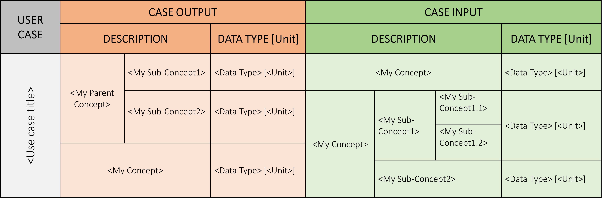
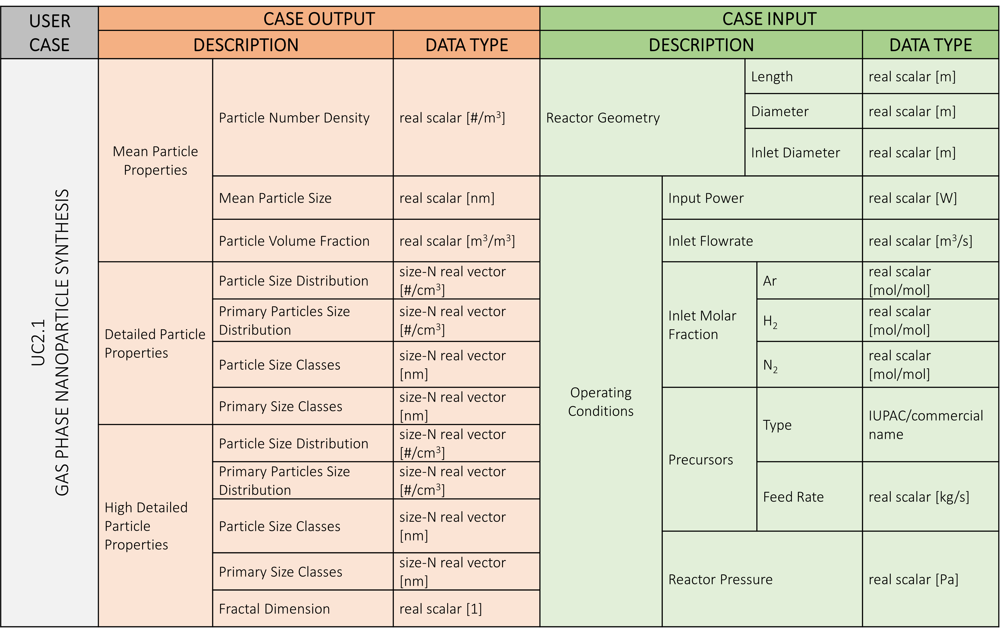
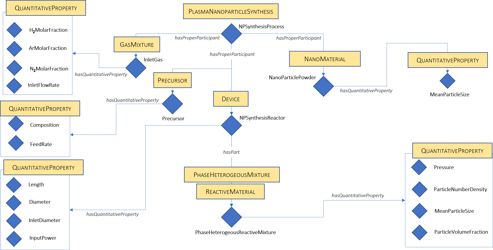

# Create an Ontology for SimDOME OSP Wrappers

## Context
[SimDOME OSP](https://osp.simdome.eu/) hides the complexity of several software components and provides a means to facilitate data interoperability. The latter is achieved by describing all use cases with a common vocabulary based on standards, in particular the [Elementary Multiperspective Materials Modelling Ontology (EMMO)](https://github.com/emmo-repo/EMMO).

This common representation is enabled by the SimPhoNy wrapper components used in SimDOME OSP as interfaces to the various simulation codes. As described in [SimPhoNy Documentation](https://simphony.readthedocs.io/en/v4.0.0/), SimPhoNy wrappers work using knowledge graphs based on **ontologies**. 

For the specific case of SimDOME, different simulation codes (at diffrent scales atomistic, mesoscopic, continuum) are executed from the OSP. Normaly, to communicate with each code the user has to provide the simulation parameters including inputs and outputs according to the code's syntax. In SimDOME, the user can simply use the common language provided via the ontology to specify simulation parameters and run the simulation. The SimPhoNy wrappers deal with the mapping between each code syntax and the Ontology vocabulary.

To facilitate the creation of the Ontologies by the domain experts, the methodology described in the following sections was followed in SimDOME project. New users of SimDOME OSP interested in extending it with a new code via a wrapper are invited to follow it. Please note that the presented approach does not aim to replace any well-documented and published ontology developement methodology accepted in the community. This approach will simply support accelerating the wrappers development. More advanced methodologies as well as use of the semantic web standard for ontologies - [Web Ontology Language](https://www.w3.org/TR/owl2-overview/)- are recommended.

## Ontology development
### Collect pertinent concepts
To facilitate the collection of all relevant concepts for the wrapper ontologies, Table 1 was developed and completed for each application together with the domain experts.

<figure style="display: table; text-align:center; margin-left: auto; margin-right:auto">

</figcaption>

<figcaption style="display: table-caption; caption-side: top ; text-align:left">

_Table 1 - Template for the collection of relevant concepts._

</figcaption>

</figure>

Tabe 1 tries to depict in a simplified and meaningful manner all pertinent concepts for describing a specific application (simulation). The first column (grey) is used to specify the name/label of the use case and is followed by columns dedicated to the simulation inputs (light green) and outputs (light orange) specification.

As decribed in Table 1, a minimal hieralchical organization (parent concept/category and sub-concept) of the inputs and outputs concepts should be provided when applicable. Additionally the data type  (*e.g.*: string, float, scalar, vector) should also be specified. Table 1 also comprises a column to specify the units as it is required when dealing with quantities.

Table 2 provides an example comprising all relevant concepts for the [SimNanoDOME wrapper](https://github.com/simphony/SimNanoDOME) wich was used as starting point for the ontology development. 

<figure style="display: table; text-align:center; margin-left: auto; margin-right:auto">

</figcaption>

<figcaption style="display: table-caption; caption-side: top ; text-align:left">

_Table 2 - Pertinent concepts for the SimNanoDOME wrapper._

</figcaption>

</figure>

### Ontology conceptualization

Once the collection of pertinent concepts is finalized (*e.g.*: Table 2) an initial conceptualizatoin of the ontology can be made. In SimDOME we used diagrams as represented in Figure 1 to capture all relevant concepts provided in Table 2 as well as the relationships among them.

<figure style="background-color: white;display: table; text-align:center; margin-left: auto; margin-right:auto">

</figcaption>

<figcaption style="display: table-caption; caption-side: bottom ; text-align:left">

_Figure 1 - Graphical conceptulaization of the ontology._

</figcaption>

</figure>

### Ontology formalization in OWL

The ontology formalization in OWL can then be realized based on the conceptualization described above. To do it you can use your favourite ontology editor (*e.g.*: [Protégé](https://protege.stanford.edu/)).

